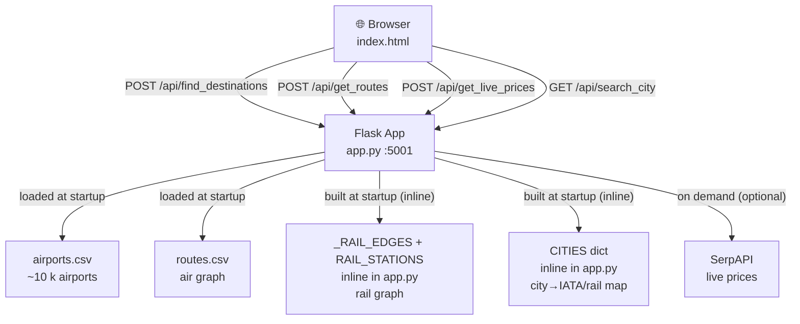
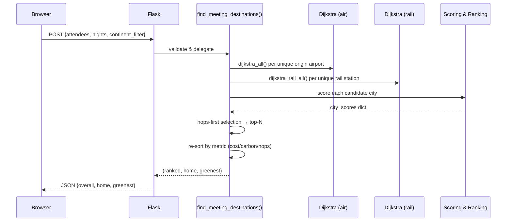
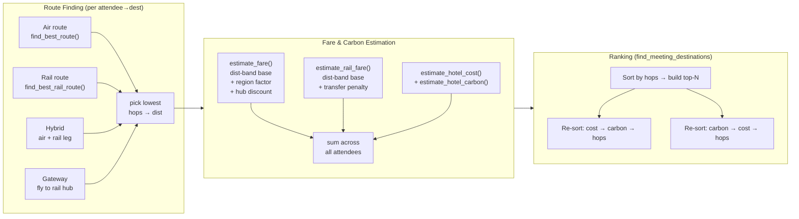

# MeetingCalculator — Architecture Diagrams

## 1 · System Architecture

```mermaid
graph TD
    Browser["🌐 Browser\nindex.html"]
    Flask["Flask App\napp.py :5001"]
    CSV1["airports.csv\n~10 k airports"]
    CSV2["routes.csv\nair graph"]
    Rail["_RAIL_EDGES + RAIL_STATIONS\ninline in app.py\nrail graph"]
    Cities["CITIES dict\ninline in app.py\ncity→IATA/rail map"]
    SerpAPI["SerpAPI\nlive prices"]

    Browser -->|"POST /api/find_destinations"| Flask
    Browser -->|"POST /api/get_routes"| Flask
    Browser -->|"POST /api/get_live_prices"| Flask
    Browser -->|"GET /api/search_city"| Flask

    Flask -->|"loaded at startup"| CSV1
    Flask -->|"loaded at startup"| CSV2
    Flask -->|"built at startup (inline)"| Rail
    Flask -->|"built at startup (inline)"| Cities
    Flask -->|"on demand (optional)"| SerpAPI
```

## 2 · find_destinations Request Flow

```mermaid
sequenceDiagram
    participant B as Browser
    participant F as Flask
    participant D as find_meeting_destinations()
    participant DJ as Dijkstra (air)
    participant DR as Dijkstra (rail)
    participant SC as Scoring & Ranking

    B->>F: POST {attendees, nights, continent_filter}
    F->>D: validate & delegate
    D->>DJ: dijkstra_all() per unique origin airport
    D->>DR: dijkstra_rail_all() per unique rail station
    D->>SC: score each candidate city
    SC-->>D: city_scores dict
    D->>D: hops-first selection → top-N
    D->>D: re-sort by metric (cost/carbon/hops)
    D-->>F: (ranked, home, greenest)
    F-->>B: JSON {overall, home, greenest}
```

## 3 · Routing & Scoring Pipeline

```mermaid
flowchart LR
    subgraph Routing["Route Finding (per attendee→dest)"]
        direction TB
        Air["Air route\nfind_best_route()"]
        Rail["Rail route\nfind_best_rail_route()"]
        Hybrid["Hybrid\nair + rail leg"]
        GW["Gateway\nfly to rail hub"]
        Best["pick lowest\nhops → dist"]
        Air --> Best
        Rail --> Best
        Hybrid --> Best
        GW --> Best
    end

    subgraph Scoring["Fare & Carbon Estimation"]
        direction TB
        Fare["estimate_fare()\ndist-band base\n+ region factor\n+ hub discount"]
        RailFare["estimate_rail_fare()\ndist-band base\n+ transfer penalty"]
        Hotel["estimate_hotel_cost()\n+ estimate_hotel_carbon()"]
        Total["sum across\nall attendees"]
        Fare --> Total
        RailFare --> Total
        Hotel --> Total
    end

    subgraph Ranking["Ranking (find_meeting_destinations)"]
        direction TB
        HopsFirst["Sort by hops → build top-N"]
        RedisplayC["Re-sort: cost → carbon → hops"]
        RedisplayGr["Re-sort: carbon → cost → hops"]
        HopsFirst --> RedisplayC
        HopsFirst --> RedisplayGr
    end

    Best --> Scoring
    Scoring --> Ranking
```
